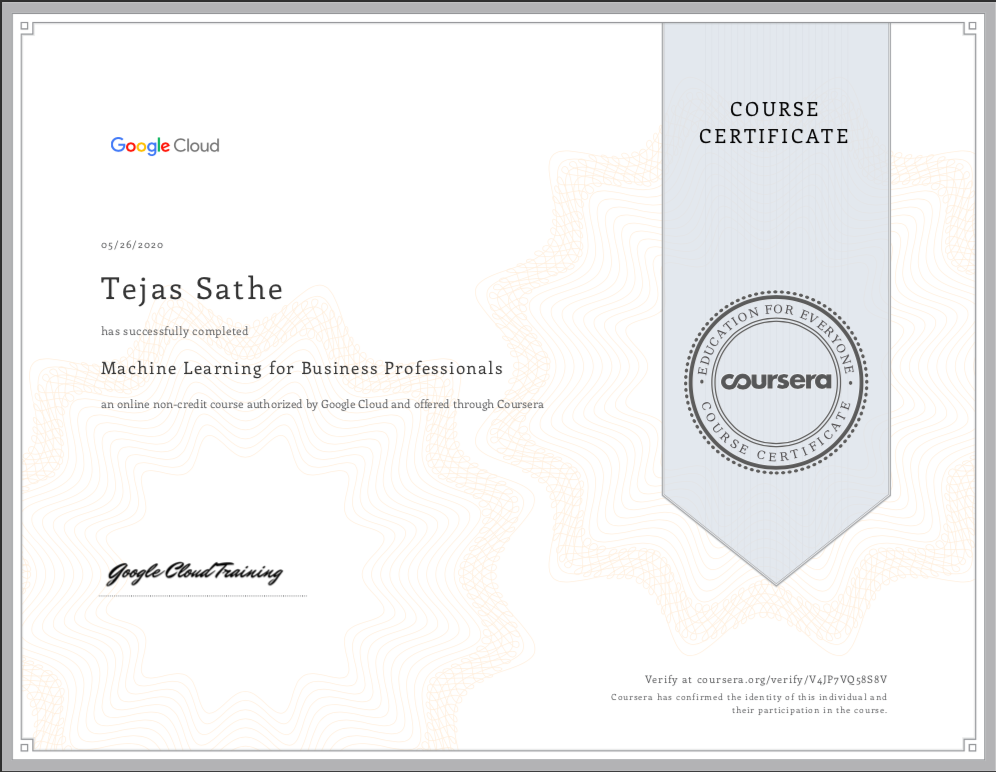
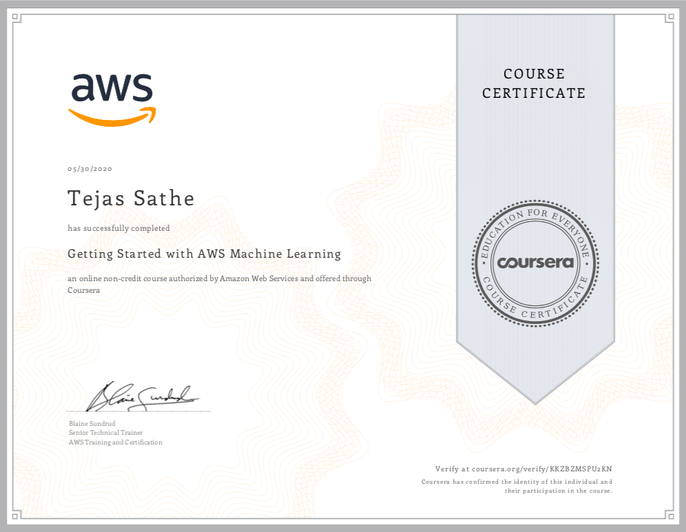
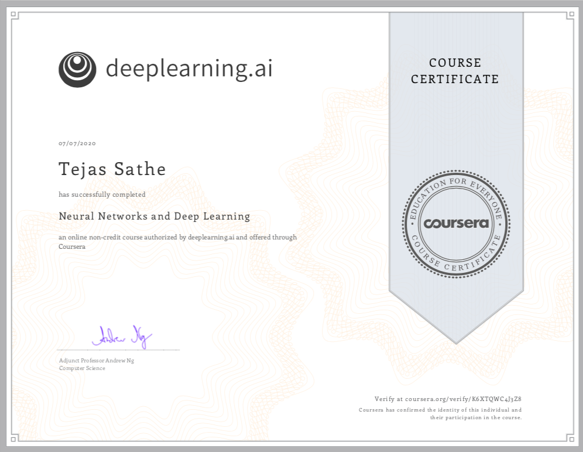

# certificates

## 1. `Coursera Business` Machine Learning

## 2. `Coursera AWS` Machine Learning

## 3. `Coursera Neural Network` Machine Learning

# Two More Ongoing
a. Machine learning with andrew ng.

b. Convolutional Network.

``Click the images to Verify the certificate from Coursera``

``Click the link below to see projects``
https://github.com/tejassathe117/Projects